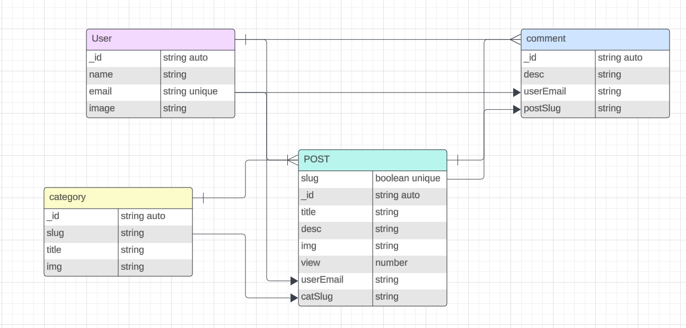
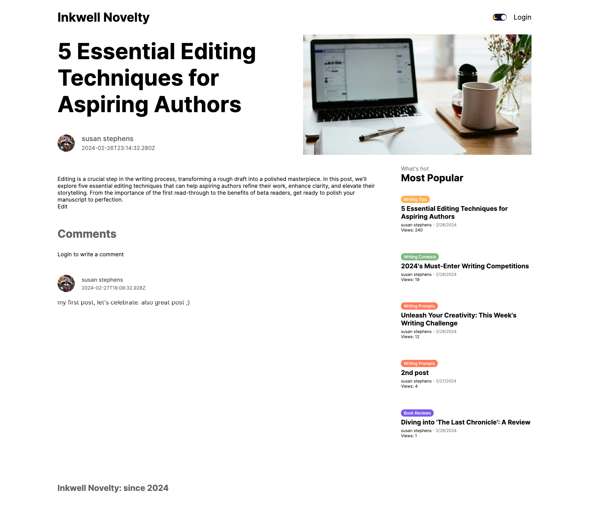
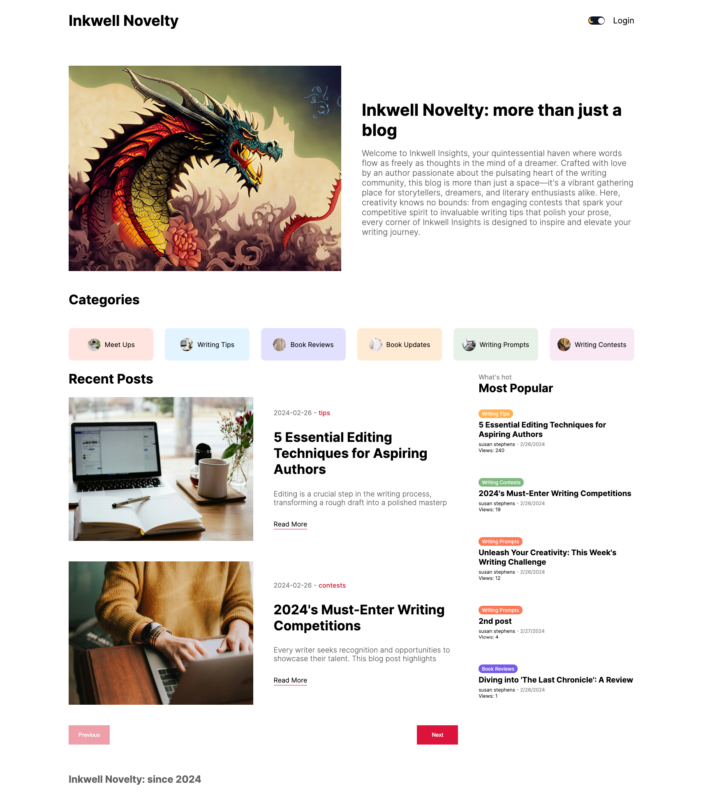

# Inkwell Novelty
### what is it?
a simple blog site where people can come to learn about the authors updates, events and more. they can add comments to posts and edit or delete them if needed.

## Installment
- Fork and Clone the repo
- npm install all the dependencies
- create your own oAuth, Firebase, database creditials
- run 'npm run dev'

## Technologies Used
#### Front-End
- Next.js
#### Back-End
- Prisma
- MongoDB
### Other
- SWR
- React-Quill
- Jest
- Firebase Storage
- oAuth (google)


## ERD



- user can have many comments and posts
- posts can have many commments
- posts can have only 1 category
- comments can have only 1 user and post

### Screen Shots



## Code Snippets

i chose this snippet because it shows easily how a small portion of code can require several levels of user dependencies (who can read, write, edit ect..)
```javascript
return (
        <div className={styles.container}>
            <h1 className={styles.title}>Comments</h1>
            {status === "authenticated" ? (
                <div className={styles.write}>
                    <textarea
                        placeholder="write a comment..."
                        className={styles.input}
                        onChange={(e) => setDesc(e.target.value)}
                    />
                    <button className={styles.button} onClick={handleSubmit}>
                        Send
                    </button>
                </div>
            ) : (
                <Link href="/login">Login to write a comment</Link>
            )}
            <div className={styles.comments}>
                {isLoading
                    ? "loading"
                    : data?.map((item, index) => (
                        <div className={styles.comment} key={index}>
                            <div className={styles.user}>
                                {item?.user?.image && (
                                    <Image
                                        src={item.user.image}
                                        alt=""
                                        width={50}
                                        height={50}
                                        className={styles.image}
                                    />
                                )}
                                <div className={styles.userInfo}>
                                    <span className={styles.username}>{item.user.name}</span>
                                    <span className={styles.date}>{item.createdAt}</span>
                                </div>
                            </div>
                            <p className={styles.desc}>{item.desc}</p>
                            {status === "authenticated" && session.user.email === item.userEmail && (
                                <>
                                    <button className={styles.CommentBtn} onClick={() => handleDelete(item.id)}>Delete</button>
                                    <button className={styles.CommentBtn} onClick={() => handleEdit(item.id, item.desc)}>Edit</button>
                                </>
                            )}
                            {isEditing && (
                                <div className={styles.editModal}> {/* You need to style this */}
                                    <textarea
                                        value={editDesc}
                                        onChange={(e) => setEditDesc(e.target.value)}
                                        className={styles.editInput} // Style as needed
                                    />
                                    <button onClick={handleSubmitEdit}>Submit</button>
                                    <button onClick={() => setIsEditing(false)}>Cancel</button>
                                </div>
                            )}
                        </div>

                    ))}
            </div>
        </div>
    );

```